# feedbacks

The one of the main things I experienced is while doing agentic coding is staying in the loop and not losing the context.
Also sometimes agents do stupid non-efficient stuff. You need to intervene that early to not fuckup in the near feature.
It started making much more sense after I read [the brief post from the creator of Django](https://simonwillison.net/2026/Feb/15/cognitive-debt/).
I always try to find a way to add comments to my agent and pass it to my agent before committing anything to the git.
So I developed this little plugin for my claude code. It is super simple.
I added `// @feedback:` annotations using my editor and my agent address and response them.
Just dead simple and good enough to do review and address the changes.

A Claude Code plugin that finds `@feedback` annotations in source code and addresses them by implementing the requested changes.

## Workflow

```mermaid
graph LR
    A["Add @feedback comments"] --> B["/feedbacks:address"]
    B --> C["Review changes + @agent-response"]
    C --> D["/feedbacks:resolve"]
    D --> E["Clean code → commit"]
```



## Installation

```bash
# Add the marketplace
claude plugin marketplace add obsfx/cc-feedback

# Install the plugin
claude plugin install feedbacks
```

Or in Claude Code interactive mode:

```
/plugin marketplace add obsfx/cc-feedback
/plugin install feedbacks
```

## How It Works

Sprinkle `@feedback` comments in your code to describe desired changes. The plugin finds them, implements the changes, and leaves an `@agent-response` for you to review.

**Before:**
```js
// @feedback: extract this into a reusable hook
export function Component() {
  const [data, setData] = useState([]);
  useEffect(() => { fetchData().then(setData); }, []);
  return <List items={data} />;
}
```

**After:**
```js
// @feedback: extract this into a reusable hook
// @agent-response: extracted to hooks/useData.ts
export function Component() {
  const data = useData();
  return <List items={data} />;
}
```

## Supported Comment Styles

Works with any language's comment syntax:

| Style | Languages |
|-------|-----------|
| `// @feedback: ...` | JS, TS, Java, Go, C, Rust, Swift |
| `# @feedback: ...` | Python, Ruby, Shell, YAML |
| `/* @feedback: ... */` | CSS, SCSS, C (block) |
| `<!-- @feedback: ... -->` | HTML, XML, Vue |
| `-- @feedback: ...` | SQL, Lua, Haskell |

## Usage

### Command: `/feedbacks:address`

Explicitly scan and address all `@feedback` annotations in the codebase:

```
/feedbacks:address
/feedbacks:address src/components/
```

- Finds all `@feedback` annotations
- Skips already-addressed ones (those with `@agent-response`)
- Implements each change
- Adds `@agent-response: <summary>` for review

### Command: `/feedbacks:list`

List all `@feedback` annotations with their status and agent responses:

```
/feedbacks:list
/feedbacks:list src/components/
```

### Command: `/feedbacks:resolve`

Remove all `@feedback` and `@agent-response` annotation lines from the codebase, leaving clean code ready to commit:

```
/feedbacks:resolve
/feedbacks:resolve src/components/
```

### Proactive Detection

The plugin also includes an agent that notices `@feedback` annotations while working on other tasks and offers to address them.

## Annotation Lifecycle


## Components

| Component | Purpose |
|-----------|---------|
| `/feedbacks:address` | Scan and implement all feedbacks |
| `/feedbacks:list` | List all annotations with status |
| `/feedbacks:resolve` | Remove annotation comments for clean commit |
| `feedback-protocol` skill | Protocol knowledge, auto-loaded when relevant |
| `feedback-addresser` agent | Autonomous worker, proactive detection |

## License

MIT
